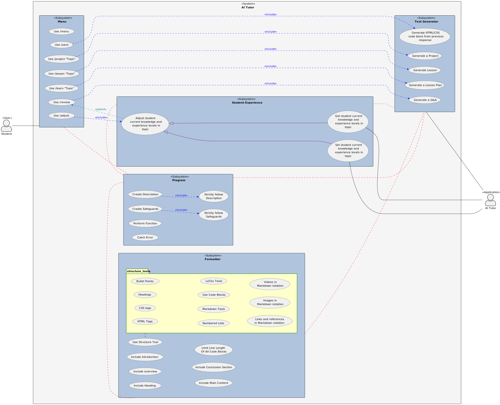

# Rashino's Prompts

## Overview

Here you can find prompts that I myself have created. All of my prompts are 
created from pure scratch, and I can provide images of the progress of each
prompt dating back to as far as January.

## My Ideas

### PlantUML

I had the idea of generating and including [PlantUML
Diagrams](https://plantuml.com/) into prompts in January. I've done some testing
since and have found that they are capable of revolutionizing the way prompts
are created when utilized correctly.

<u>*Example of the framework for the new AI Tutor I'm working on:*</u>

I've been able to use a simple use-case diagram and have a program generated
in python entirely based off it, and have also used plantuml diagrams as 
frameworks for the way that LLM should operate and process input. Both have
worked amazingly.

### Modular Prompts

Building off of the above, I've found that I can create modular prompts such as
in the above framework, by creating "programs" within an overall system and
specifying the properties and functions of each program. This allows me to
copy/paste pre-existing prompts (and plantuml assets) to build new prompts
with minimum effort.

For example, I created a "Plantuml Initializer" prompt that allows plantuml
diagrams to be used. From there, I could drag and drop the "menu" program into
the system to have it integrated into the prompt.

## My Prompts

- [AI Tutor](prompts/ai_tutor.md)
  - Being replaced with an entirely new one soon.
- [Advanced Note-Taker](prompts/advanced_note_taker.md)
- [WebChatGPT](prompts/webchatgpt.md)